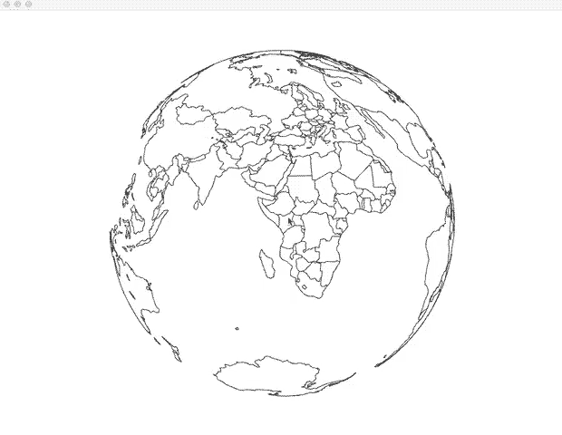

ofxGeoJSON
---

ofxGeoJSON is an addon for openFrameworks to load and draw GeoJSON format files.

### GeoJSON

[The GeoJSON Format Specification](http://geojson.org/geojson-spec.html)

### Test environment
- OSX 10.11 + XCode 7.1.1 + o/F 0.9.0

### Feature
- Converting Geo Coordinate to Cartesian Coodinate (Mercator / Equirectangular / Azimuthal Equarlarea / Streographic / Spherical Projection)

### Dependency
ofxJSON : [https://github.com/jefftimesten/ofxJSON](https://github.com/jefftimesten/ofxJSON)

### Not implemented yet
- Making mesh as polygon
- Safe JSON parsing
- Now aceptable geometry types are 'polygon' and 'MultiPolygon' only.
- Multi-platform
