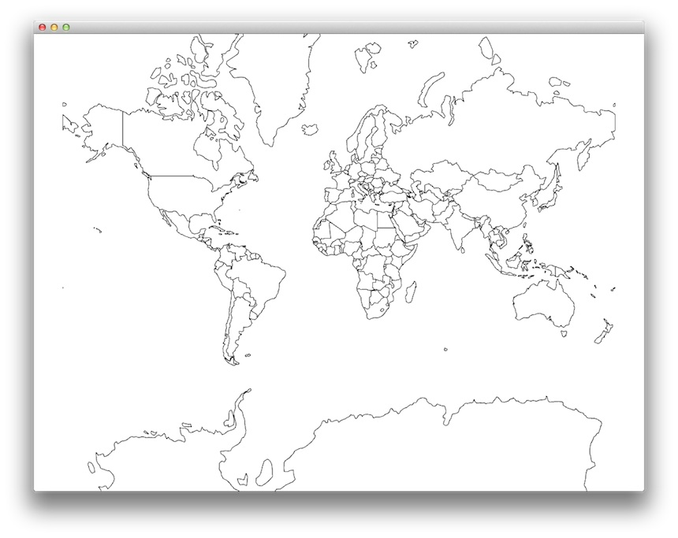

ofxGeoJSON
---

ofxGeoJSON is an addon for openFrameworks to load and draw GeoJSON format files.

###GeoJSON

[The GeoJSON Format Specification](http://geojson.org/geojson-spec.html)

###Test environment
- OSX 10.9.5 + XCode 6.0 + o/F 0.8.4

###Feature
- Converting Geo Coordinate to Cartesian Coodinate (Mercator / Equirectangular Projection)

###Dependency
ofxJSON : [https://github.com/jefftimesten/ofxJSON](https://github.com/jefftimesten/ofxJSON)

###Not implemented yet
- Making mesh as polygon
- Safe JSON parsing
- Drawing indivisual features with 'name' property or indexes.
- Now aceptable geometry types are 'polygon' and 'MultiPolygon' only.
- Multi-platform

##License

[MIT License](https://secure.wikimedia.org/wikipedia/en/wiki/Mit_license)

Copyright (c) 2013 Koichiro Mori

Permission is hereby granted, free of charge, to any person obtaining a copy of this software and associated documentation files (the "Software"), to deal in the Software without restriction, including without limitation the rights to use, copy, modify, merge, publish, distribute, sublicense, and/or sell copies of the Software, and to permit persons to whom the Software is furnished to do so, subject to the following conditions:

The above copyright notice and this permission notice shall be included in all copies or substantial portions of the Software.

THE SOFTWARE IS PROVIDED "AS IS", WITHOUT WARRANTY OF ANY KIND, EXPRESS OR IMPLIED, INCLUDING BUT NOT LIMITED TO THE WARRANTIES OF MERCHANTABILITY, FITNESS FOR A PARTICULAR PURPOSE AND NONINFRINGEMENT. IN NO EVENT SHALL THE AUTHORS OR COPYRIGHT HOLDERS BE LIABLE FOR ANY CLAIM, DAMAGES OR OTHER LIABILITY, WHETHER IN AN ACTION OF CONTRACT, TORT OR OTHERWISE, ARISING FROM, OUT OF OR IN CONNECTION WITH THE SOFTWARE OR THE USE OR OTHER DEALINGS IN THE SOFTWARE.